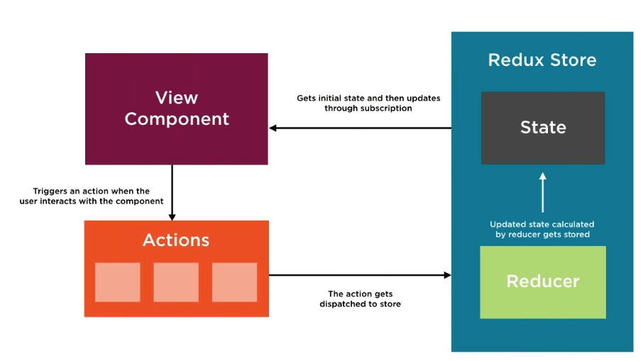

## Using Redux to Manage State in Angular - Pluralsight
  https://www.pluralsight.com/courses/angular-2-redux-manage-state
  
  https://github.com/hendrikswan/pluralsight-angular-redux

## Redux Workflow
  